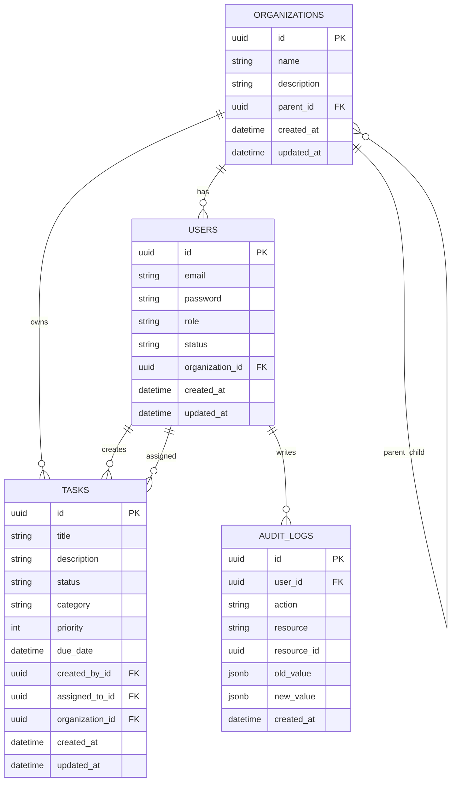

# Full Stack Coding Challenge: Secure Task Management

## Setup Instructions

Prerequisites:
- Node.js 20+
- npm
- Docker (for PostgreSQL)

1) Configure environment variables for the API.

The NestJS API reads `.env` from the repository root (see `apps/api/src/app/app.module.ts`).
Create a root `.env` based on the example:

```sh
copy apps/api/.env.example .env
```

Minimum required values in `.env`:

```
DATABASE_HOST=localhost
DATABASE_PORT=5432
DATABASE_NAME=taskmanager_dev
DATABASE_USER=postgres
DATABASE_PASSWORD=devpassword
JWT_SECRET=your_access_secret
JWT_REFRESH_SECRET=your_refresh_secret
```

2) Start PostgreSQL with Docker Compose.

```sh
docker compose up -d postgres
```

3) Run the backend API.

```sh
npx nx serve api
```

4) Run the frontend dashboard.

```sh
npx nx serve dashboard
```

Seed data:
- The API runs `SeedService` on startup. It creates an organization hierarchy, users, and sample tasks when the system user does not exist.
- Test accounts created by seed:
  - `admin@system.com` / `password123` (Owner - full access)
  - `admin@acme.com` / `password123` (Admin - task management, no org management)
  - `alice@acme.com` / `password123` (Viewer - read-only, sees own/assigned tasks)
  - `bob@acme.com` / `password123` (Viewer - read-only, sees own/assigned tasks)
  - `pending@acme.com` / `password123` (Pending - blocked until approved)

If the seed already ran, it will skip. To re-seed, delete `admin@system.com` or reset the database.

## Architecture Overview

Nx monorepo with clear separation of concerns.

Applications:
- `apps/api`: NestJS + TypeORM + JWT auth
- `apps/dashboard`: Angular + TailwindCSS UI

Shared libraries:
- `libs/data`: DTOs, enums, and interfaces shared by backend and frontend
- `libs/auth`: role/permission decorators and guards used by the API

## Data Model Explanation

Core entities and relationships:
- `organizations` have a parent/child structure via `parent_id` (2-level hierarchy)
- `users` belong to an organization and have a role and status
- `tasks` belong to an organization, have a creator, and can have an assignee
- `audit_logs` capture task lifecycle actions (create, update, delete)



## Access Control Implementation

Roles:
- Owner, Admin, Viewer (defined in `libs/data/src/lib/enums/role.enum.ts`)
- Role inheritance is enforced by `RolesGuard` using `RoleHierarchy`

Permissions:
- Defined in `libs/data/src/lib/enums/permission.enum.ts`
- Enforced with `@Permissions()` + `PermissionsGuard`

Guards and flow:
- `JwtAuthGuard` is global (all routes require JWT unless marked `@Public()`)
- `ActiveUserGuard` blocks `PENDING` and `REJECTED` accounts
- `RolesGuard` + `PermissionsGuard` enforce role-based and permission-based access

Organization and task scope:
- Tasks are scoped by `organizationId` in `TasksService`
- Viewer visibility: only tasks created by them or assigned to them
- Admin visibility: all tasks in their organization
- Owner visibility: all tasks in their organization
- The organization hierarchy is stored in the DB and supported by `OrganizationGuard`, but task queries currently filter by the user organization ID only (no parent/child expansion)

Role capability matrix:

| Capability | Owner | Admin | Viewer | Pending |
| --- | --- | --- | --- | --- |
| Login | Yes | Yes | Yes | Yes (redirected to pending screen) |
| Access dashboard | Yes | Yes | Yes (read-only) | No |
| Create tasks | Yes | Yes | No | No |
| Update/Delete tasks | Yes | Yes | No | No |
| Reorder tasks (drag-and-drop) | Yes | Yes | No | No |
| View tasks | Yes (all in org) | Yes (all in org) | Limited (created/assigned only) | No |
| View task details modal | Yes (edit mode) | Yes (edit mode) | Yes (read-only mode) | No |
| View audit logs | Yes | Yes | No | No |
| Approve/reject registrations | Yes | Yes | No | No |
| View organizations/users | Yes | Yes | No | No |

## Role-Based UI Experience

The frontend adapts to each user's role with purpose-built interfaces:

**Owner/Admin Experience:**
- Full task management: create, edit, delete, reorder via drag-and-drop
- Status dropdown on each task card for quick updates
- Access to "Approvals" admin panel for user registration management
- Purple (Owner) or blue (Admin) role badge in navigation

**Viewer Experience:**
- Read-only dashboard with informational banner explaining access level
- "View Details" button on each task card opens a read-only modal with full task information
- Ownership context badges on task cards: "Created by you", "Assigned to you", or both
- Status displayed as static badge (no dropdown)
- Gray role badge in navigation
- Contextual empty state: "No tasks assigned to you yet"

**Pending User Experience:**
- Redirected to dedicated pending approval page after login
- Clear messaging about account status
- Logout option to return to login

This role-differentiated UI ensures users understand their capabilities at a glance while providing Viewers with meaningful interaction through the task details modal.

Audit logging:
- Task create/update/delete create an `AuditLog` entry
- Audit log endpoints are restricted to Owner/Admin with `Permission.AUDIT_VIEW`

Authentication:
- `POST /auth/login` issues access and refresh tokens
- Tokens include user ID, role, status, and organization ID
- The Angular client stores tokens and attaches `Authorization: Bearer <token>` on requests

## API Docs

Public:
- `POST /auth/register`
- `POST /auth/login`
- `POST /auth/refresh`

Admin/Owner only:
- `GET /admin/registrations`
- `POST /admin/registrations/:userId/approve`
- `POST /admin/registrations/:userId/reject`
- `GET /admin/organizations`
- `GET /admin/users?organizationId=...`
- `GET /audit-log`
- `GET /audit-log/actions`
- `GET /audit-log/resources`

Tasks (authenticated with permissions):
- `POST /tasks` (Owner/Admin)
- `GET /tasks`
- `GET /tasks/:id`
- `PUT /tasks/:id` (Owner/Admin)
- `DELETE /tasks/:id` (Owner/Admin)
- `PUT /tasks/:id/reorder` (Owner/Admin)

Sample requests and responses:

Register

```json
{
  "email": "new.user@example.com",
  "password": "password123"
}
```

```json
{
  "message": "Registration submitted. Please wait for admin approval."
}
```

Login

```json
{
  "email": "admin@system.com",
  "password": "password123"
}
```

```json
{
  "accessToken": "jwt-access-token",
  "refreshToken": "jwt-refresh-token",
  "user": {
    "id": "user-uuid",
    "email": "admin@system.com",
    "firstName": "System",
    "lastName": "Admin",
    "role": "owner",
    "status": "active",
    "organizationId": "org-uuid"
  }
}
```

Create task

```json
{
  "title": "Prepare onboarding",
  "description": "Set up access and tools",
  "category": "work",
  "priority": 3,
  "assignedToId": "user-uuid"
}
```

```json
{
  "id": "task-uuid",
  "title": "Prepare onboarding",
  "description": "Set up access and tools",
  "status": "todo",
  "category": "work",
  "priority": 3,
  "createdById": "owner-uuid",
  "assignedToId": "user-uuid",
  "organizationId": "org-uuid",
  "createdAt": "2026-01-10T12:00:00.000Z",
  "updatedAt": "2026-01-10T12:00:00.000Z"
}
```

List tasks

```json
{
  "data": [
    {
      "id": "task-uuid",
      "title": "Prepare onboarding",
      "description": "Set up access and tools",
      "status": "todo",
      "category": "work",
      "priority": 3,
      "createdById": "owner-uuid",
      "assignedToId": "user-uuid",
      "organizationId": "org-uuid",
      "createdAt": "2026-01-10T12:00:00.000Z",
      "updatedAt": "2026-01-10T12:00:00.000Z"
    }
  ],
  "meta": {
    "total": 1,
    "page": 1,
    "limit": 10,
    "totalPages": 1
  }
}
```

Update task

```json
{
  "status": "in_progress",
  "priority": 5
}
```

```json
{
  "id": "task-uuid",
  "title": "Prepare onboarding",
  "description": "Set up access and tools",
  "status": "in_progress",
  "category": "work",
  "priority": 5,
  "createdById": "owner-uuid",
  "assignedToId": "user-uuid",
  "organizationId": "org-uuid",
  "createdAt": "2026-01-10T12:00:00.000Z",
  "updatedAt": "2026-01-10T12:05:00.000Z"
}
```

Delete task

```json
{
  "id": "task-uuid"
}
```

```json
{}
```

Audit log (filter by action)

```json
{
  "action": "UPDATE",
  "page": 1,
  "limit": 10
}
```

```json
{
  "data": [
    {
      "id": "audit-uuid",
      "userId": "user-uuid",
      "action": "UPDATE",
      "resource": "Task",
      "resourceId": "task-uuid",
      "oldValue": { "status": "todo" },
      "newValue": { "status": "in_progress" },
      "createdAt": "2026-01-10T12:05:00.000Z"
    }
  ],
  "meta": {
    "total": 1,
    "page": 1,
    "limit": 10,
    "totalPages": 1
  }
}
```

## UI Routes

| Route | Guard | Purpose |
| --- | --- | --- |
| `/auth/login` | `guestGuard` | Login screen |
| `/auth/register` | `guestGuard` | Registration screen |
| `/auth/registration-submitted` | None | Post-registration confirmation |
| `/auth/pending` | None | Pending account notice after login |
| `/dashboard` | `authGuard` | Main task dashboard |
| `/admin/approvals` | `authGuard` | Pending user approvals |
| `/**` | Redirect | Fallback to `/dashboard` |

## Testing Strategy

Backend (NestJS + Jest):
- Unit tests target service and controller logic, with repositories and external dependencies mocked to keep tests fast and deterministic.
- RBAC and permission flow is exercised at the controller level by validating that guarded endpoints enforce role and permission metadata.
- Task service tests validate visibility rules (Owner/Admin/Viewer), pagination, filtering, and audit log writes on create/update/delete.
- Auth tests validate login/refresh behavior, password checks, and guard behavior without requiring a live database.
- Run: `npx nx test api`

Frontend (Angular + Jest):
- Unit tests cover auth flows (login/register), guard behavior, and core services (AuthService/TaskService) using mocked HTTP calls.
- Component tests focus on rendering and role-driven UI behavior (e.g., task card UI variants).
- NgRx effects and reducers are exercised indirectly via service and guard tests where appropriate.
- Run: `npx nx test dashboard`

Why this approach:
- Unit tests provide quick feedback within the timebox and validate RBAC and auth logic without relying on a running database or API server.
- API surface and data access are verified at the service boundary, while UI logic is verified at component/service boundaries.

Manual API Testing (Postman):
- A set of JSON request definitions is provided under `manual-api-tests/` for every API route.
- Each file name matches the method and route (example: `POST_tasks.json`, `GET_audit-log.json`).
- Use these environment variables in Postman: `baseUrl`, `accessToken`, `refreshToken`, `userId`, `taskId`, `organizationId`, `assignedToId`.
- Suggested flow:
  1) `POST_auth_register.json` to create a pending user.
  2) `POST_auth_login.json` to login as an Owner/Admin and capture tokens.
  3) `GET_admin_registrations.json` and `POST_admin_registrations_userId_approve.json` to approve the pending user.
  4) Login as the newly approved user and verify guard behavior across task and admin routes.
  5) Create/update/reorder/delete tasks and confirm audit entries with `GET_audit-log.json`.

## Submission Checklist

- Backend runs: `npx nx serve api`
- Frontend runs: `npx nx serve dashboard`
- Database ready (Docker): `docker compose up -d postgres`
- Environment configured in root `.env` with JWT + DB settings
- Unit tests pass: `npx nx test api`, `npx nx test dashboard`
- Manual API tests available: `manual-api-tests/`
- README includes setup, architecture, ERD, access control, API docs, testing, future considerations

## Future Considerations

- Advanced role delegation (custom role templates per organization)
- Production-ready security (refresh token rotation, token revocation, CSRF protection for cookie-based auth, rate limiting)
- Efficient permission checks at scale (permission caching and precomputed scopes)
- Expand owner visibility to include parent/child organization hierarchy in task queries
